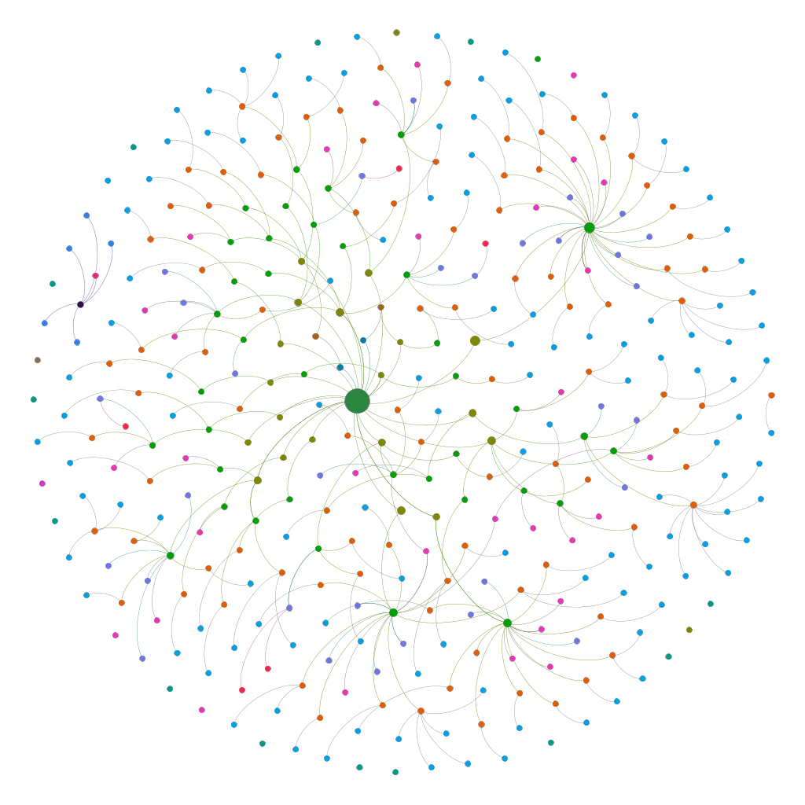
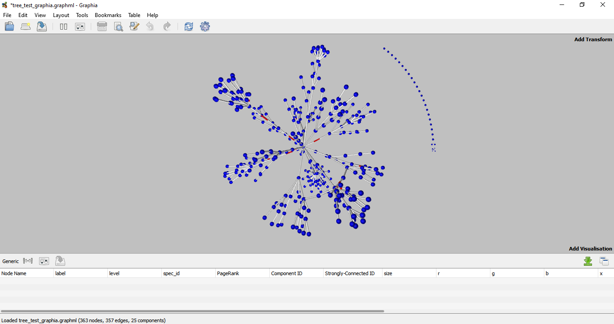

# Oahu Trees Visualization Project
This is the final project for for Data Visualization Fall '22.  
Oahu Trees is a visualization of the taxonomic relationship between the trees on Oahu, Hawaii. The tree data is sourced from Exceptional Trees on Oahu API, and Wikipedia. The visualizations were built in both Gephi and Graphia.

The final result of the project is a tree (directed acyclic graph) of the oahu tree taxonomic heirarchy. 

## Notes:
This all coding components of this project. This repository, presentation and write up were submitted on 11/30/22.

### Oahu Tree Data
Sourced from ['Exceptional Trees on Oahu ' API]( https://dev.socrata.com/foundry/data.honolulu.gov/84fd-3fzf)

### Wiki Scrape for Tree Classification Data
wiki_scrape.py
utility.py

Built wiki_scrape.py and utility.py to automate data gathering. 
Collects taxonomic data from Wiki page `infobox biota` class for values in genus_list.csv

#### Handled Error log: 11/1/22
[[404, 'https://en.wikipedia.org/wiki/Tetraplasadra']]
['Attalea', 'Cassia', 'Cocos', 'Hura', 'Phoenix', 'Reynoldsia', 'Terminalia']
Data will be added manually.

## Final Visualizations

### Gephi Vis

### Graphia Vis

